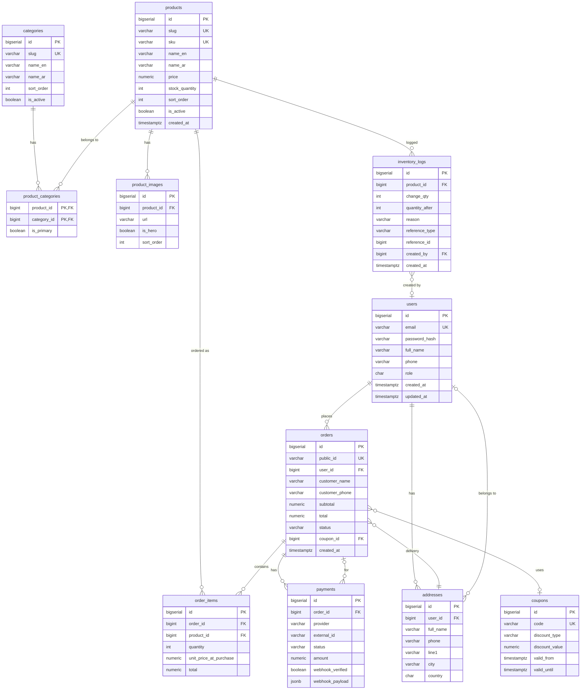

# Nana's Bites — Entity-Relationship Diagram

## Mermaid ER (tables + relationships)

---

## Tables and relationships (summary)

| Table               | Primary key     | Main FKs / relationships |
|---------------------|-----------------|---------------------------|
| **users**           | id              | —                         |
| **categories**      | id              | —                         |
| **products**        | id              | —                         |
| **product_images**  | id              | product_id → products     |
| **product_categories** | (product_id, category_id) | product_id → products, category_id → categories |
| **addresses**       | id              | user_id → users           |
| **coupons**         | id              | —                         |
| **orders**          | id              | user_id → users, delivery_address_id → addresses, coupon_id → coupons |
| **order_items**     | id              | order_id → orders, product_id → products |
| **payments**        | id              | order_id → orders         |
| **inventory_logs** | id              | product_id → products, created_by → users |

---

## Relationship rules

- **users ↔ orders**: 1 user : 0..n orders (guest orders have `user_id` NULL).
- **users ↔ addresses**: 1 user : 0..n addresses.
- **products ↔ categories**: n : m via `product_categories`; optional `is_primary` per product.
- **products ↔ product_images**: 1 product : n images; one image per product can be `is_hero`.
- **orders ↔ order_items**: 1 order : n items; each item stores `unit_price_at_purchase`.
- **orders ↔ payments**: 1 order : n payments (e.g. one COD, or Stripe + refund).
- **orders ↔ addresses**: optional `delivery_address_id`; snapshot in `shipping_*` for history.
- **orders ↔ coupons**: optional `coupon_id`; one coupon per order.
- **products ↔ inventory_logs**: 1 product : n logs; `change_qty` and `quantity_after` for stock.

---

## Business rules (from schema comments)

1. **Price at purchase**: `order_items.unit_price_at_purchase` and `total`; do not use `products.price` for past orders.
2. **Stock**: `products.stock_quantity`; use `inventory_logs` for movements (sale, restock, adjustment, return, damage).
3. **Payments**: Multiple providers per order; `external_id` for idempotency; `webhook_verified` and `webhook_payload` for webhook handling.
4. **Guest checkout**: `orders.user_id` and `orders.delivery_address_id` can be NULL; use `customer_*` and `shipping_*` snapshot.
5. **Product soft-delete**: Prefer `products.is_active = false`; `order_items.product_id` can be SET NULL if product is removed.
6. **Coupons**: `discount_type` percent or fixed; `valid_from` / `valid_until`; `max_uses` and `uses_count` for caps.
